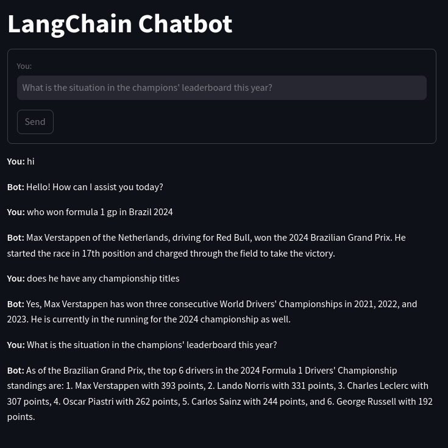

# Streamlit LangChain Chatbot

A robust, interactive chatbot application powered by [Streamlit](https://streamlit.io) and [LangChain](https://langchain.com). This project integrates language models and natural language processing capabilities to create an engaging user experience.

## Features

- **Real-time Chat Interface**
- **Integrated Search Capability for Enhanced Responses**
- **Scalable and Easy to Deploy**

## Getting Started

### Building and Running the Project

### Prerequisites

Ensure you have a `.env` file in the project root with the following content:

```env
GROQ_API_KEY=your_api_key_here
```

Replace `your_api_key_here` with your actual API key.

#### With Docker

1. **Build the Docker image**:

   ```bash
   docker build -t streamlit-langchain-chatbot .
   ```

2. **Run the Docker container**:

   ```bash
   docker run -d -p 8501:8501 --name streamlit-chatbot-container streamlit-langchain-chatbot
   ```

3. **Access the App**: Navigate to `http://localhost:8501` in your web browser.

#### Without Docker

1. **Clone the Repository**:

   ```bash
   git clone https://github.com/yourusername/streamlit-langchain-chatbot.git
   cd streamlit-langchain-chatbot
   ```

2. **Create a Virtual Environment** (optional but recommended):

   ```bash
   python -m venv venv
   source venv/bin/activate  # On Windows use `venv\Scripts\activate`
   ```

3. **Install Dependencies**:

   ```bash
   pip install -r requirements.txt
   ```

4. **Run the Application**:

   ```bash
   streamlit run app.py
   ```

5. **Access the App**: Navigate to `http://localhost:8501` in your web browser.

## Showcase

Here's what the project looks like in action:


